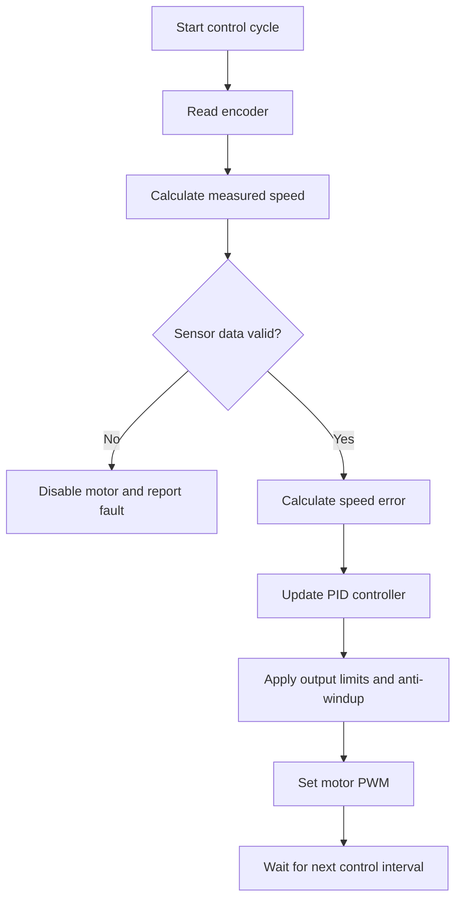

# From Hand-Drawn Flowcharts to Closed-Loop Motor Control

*Robot Builders Night Virtual — September 15, 2026*

Robotics tools have changed dramatically over the past several decades, but many of the underlying engineering practices remain familiar. During this week’s Dallas Personal Robotics Group Robot Builders Night Virtual meeting, a brief exchange connected two enduring ideas: documenting control logic with flowcharts and regulating DC motor speed with PID feedback.

One topic looked back at how developers planned systems before digital diagramming tools became commonplace. The other focused on a technique that remains fundamental to modern mobile robots, manipulators, and automated mechanisms.

## Flowcharts Before Drag-and-Drop Diagramming

Jim F. prompted a lighthearted discussion about flowcharts, recalling the manually drawn diagrams used during the late 1970s and early 1980s.

Before tools offered automatic alignment, reusable symbols, and version-controlled text formats, creating a flowchart could involve templates, rulers, drafting supplies, and considerable patience. Updating one was not always as simple as moving a box: even a minor design change could require redrawing an entire section.

Despite that history, the purpose of a flowchart has not changed. It helps developers visualize:

- Decision points and conditional branches
- Operating states and transitions
- Error-handling paths
- Sensor and actuator interactions
- Startup, shutdown, and recovery behavior
- Loops that may otherwise be difficult to follow in source code

Flowcharts can still be especially useful when explaining robot behavior to a mixed audience. A diagram showing “read sensor, evaluate condition, command motor, check fault” is often easier to review than the corresponding implementation.

### Modern Alternatives

Today’s builders can choose from graphical applications such as [diagrams.net](https://www.diagrams.net/) or text-based tools such as [Mermaid](https://mermaid.js.org/). Text-defined diagrams are particularly convenient for engineering projects because they can be stored alongside code and reviewed through the same version-control workflow.

For increasingly complex robots, traditional flowcharts may give way to finite-state machines, statecharts, behavior trees, or model-based design tools. The best representation depends on the problem: a flowchart may be ideal for a short startup routine, while a state machine is usually clearer for a robot with distinct autonomous, teleoperated, charging, and fault modes.

## Practical PID Speed Control for DC Motors

Tom Crawford shared the CurioRes video [“DC Motor PID Speed Control”](https://www.youtube.com/watch?v=HRaZLCBFVDE), a practical resource for builders interested in closed-loop motion control.

A basic DC motor can be driven by applying a PWM command through a suitable motor driver. However, a fixed command does not guarantee a fixed speed. Battery voltage, mechanical load, friction, drivetrain condition, and motor temperature can all affect the resulting motion.

Closed-loop control addresses this problem by measuring what the motor is actually doing and continually adjusting the command.

A typical speed-control loop follows this sequence:

1. Read an encoder or other speed sensor.
2. Estimate the motor’s current rotational speed.
3. Compare that speed with the target.
4. Calculate the control error.
5. Run the error through a PID controller.
6. Apply the resulting PWM command to the motor driver.
7. Repeat at a consistent interval.

Conceptually, the controller output is:

\[
u(t)=K_p e(t)+K_i\int e(t)\,dt+K_d\frac{de(t)}{dt}
\]

Here, \(e(t)\) is the difference between the requested and measured speeds.

### What the Three PID Terms Do

- **Proportional term:** Produces a response based on the current error. Increasing proportional gain generally makes the controller react more strongly, but excessive gain can cause oscillation.
- **Integral term:** Accumulates error over time. It helps correct persistent speed offsets caused by load or friction, though too much integral action can produce overshoot and windup.
- **Derivative term:** Responds to how quickly the error is changing. It may improve damping, but it can also amplify noise from encoder measurements.

Not every motor-speed controller needs all three terms. Many practical systems begin with proportional control, add integral action to eliminate steady-state error, and use derivative action only when testing shows a clear benefit. A well-tuned PI controller is often sufficient for speed regulation.

## Implementation Details That Matter

The PID equation is straightforward; dependable implementation requires attention to the surrounding system.

### Use a Consistent Sample Period

The controller should run at a predictable rate. Timing jitter changes the effective behavior of the integral and derivative calculations, making tuning less repeatable. The appropriate update frequency depends on the motor, encoder resolution, drivetrain, and processor.

### Handle Encoder Measurements Carefully

Speed is often estimated by counting encoder pulses over a time window or measuring the time between pulses. Short windows provide faster updates but may produce noisy, quantized measurements. Longer windows are smoother but introduce delay.

Low-speed operation can be particularly challenging because only a few encoder pulses may arrive during each control interval.

### Limit the Output

PWM commands have physical bounds. Once the requested output reaches those bounds, the controller cannot apply additional voltage. Integral accumulation during saturation can cause **integral windup**, leading to large overshoot when the motor finally approaches its target.

Common anti-windup strategies include:

- Clamping the integral term
- Pausing integration while the output is saturated
- Integrating only when doing so moves the controller out of saturation
- Feeding the saturation difference back into the integrator

### Account for the Real Drivetrain

Gearbox backlash, static friction, wheel contact, and mechanical loading may dominate performance. A controller tuned with the wheels suspended might behave very differently once the robot is placed on the floor.

Testing should therefore include realistic operating conditions, including acceleration, load changes, low battery voltage, and direction reversals.

## Where Flowcharts and PID Meet

Although the meeting’s two topics may appear separate, they complement each other. A PID controller handles continuous regulation, while a flowchart or state machine describes when that controller should operate and how the surrounding system should respond.

For example, a motor-control design might document logic such as:

This kind of diagram exposes more than the PID calculation. It shows timing, safety checks, actuator limits, and fault behavior—all essential parts of a robust robot.

## Final Thoughts

This week’s conversation offered a compact reminder that good robotics depends on both clear design communication and effective feedback control.

Flowcharts have moved from drafting tables to collaborative software and version-controlled text, but they still help engineers reason about behavior before committing it to code. PID control is similarly longstanding, yet it remains one of the most practical tools for turning an inexpensive DC motor into a predictable actuator.

For builders experimenting with closed-loop drive systems, the shared [CurioRes PID speed-control video](https://www.youtube.com/watch?v=HRaZLCBFVDE) provides a useful starting point. The next step is to apply the concept to real hardware, log the response, tune systematically, and document the complete control process—not just the equation.

## Suggested Visuals

- A historical photograph or illustration of a hand-drafted flowchart
- A comparison of a paper flowchart with a modern Mermaid or diagrams.net version
- A block diagram showing the motor, encoder, PID controller, and motor driver
- A plot comparing target and measured motor speed
- A tuning comparison showing underdamped, overdamped, and well-tuned responses
- A wiring diagram for a microcontroller, motor driver, DC motor, and quadrature encoder

## Resources

- [DC Motor PID Speed Control — CurioRes](https://www.youtube.com/watch?v=HRaZLCBFVDE)
- [Mermaid Diagramming and Charting Tool](https://mermaid.js.org/)
- [diagrams.net](https://www.diagrams.net/)
- [PID Controller — Wikipedia](https://en.wikipedia.org/wiki/PID_controller)